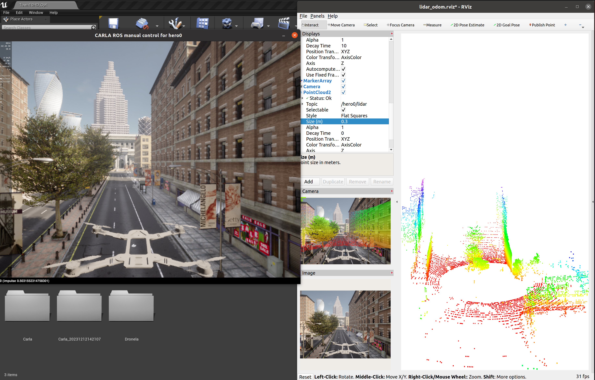

# ROS/ROS2 bridge for Dronela simulator


 This ROS package is a bridge that enables two-way communication between ROS and Dronela. The information from the Dronela server is translated to ROS topics. In the same way, the messages sent between nodes in ROS get translated to commands to be applied in Dronla.



Manual Control using the dronla drivers.


**This version requires Dronla 0.9.13**

## Features

- Provide Sensor Data (Lidar, Cameras (depth, segmentation, rgb, dvs), GNSS, Radar, IMU), Sematic lidar is currently not supported.
- Provide Object Data (Transforms (via [tf](http://wiki.ros.org/tf)), Traffic light status, Visualization markers, Collision, Lane invasion)
- Control AD Agents for drones (throttle control / yaw set point/ ) with exsiting carla inherets for cars (Steer/Throttle/Brake)
- Control Dronla (Play/pause simulation, Set simulation parameters)

## Getting started and documentation 


Installation ROS:
```bash
mkdir -p ~/dronela-ros-bridge/catkin_ws/src
cd ~/dronela-ros-bridge

git clone --recurse-submodules https://github.com/MISTLab/ros-bridge_dronela.git catkin_ws/src/ros-bridge

source /opt/ros/noetic/setup.bash

cd catkin_ws
rosdep update
rosdep install --from-paths src --ignore-src -r


catkin_make
```

Installation ROS2:
```bash
mkdir -p ~/dronela-ros-bridge/colcon_ws/src
cd ~/dronela-ros-bridge

git clone --recurse-submodules https://github.com/MISTLab/ros-bridge_dronela.git catkin_ws/src/ros-bridge

source /opt/ros/foxy/setup.bash

cd colcon_ws
rosdep update
rosdep install --from-paths src --ignore-src -r


colcon build
```

Basic driver launch: 
```bash
source <WS_ROOT>/install/setup.bash
ros2 launch carla_ros_bridge carla_ros_bridge_with_example_ego_1drone.launch.py # Single drone manual control
ros2 launch carla_ros_bridge carla_ros_bridge_with_example_ego_2drone.launch.py # two drones maual control
```
Manual Control: 
W - Forward Motion 
S - Backward Motion
A - Left Motion
D - Right MOtion

UP Arrow - Increase altitude.
Down Arrow - Decrease altitude.
Left Arrow - Yaw counter clockwise.
Right Arrow - Yaw clockwise.

instructions and further documentation of the ROS bridge and additional packages are found [__here__](https://carla.readthedocs.io/projects/ros-bridge/en/latest/).
